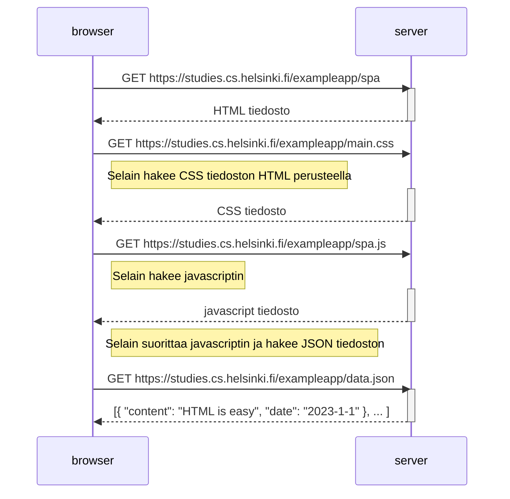

```mermaid
sequenceDiagram
    participant browser
    participant server
    
    browser->>server: GET https://studies.cs.helsinki.fi/exampleapp/spa
    activate server
    server-->>browser: HTML tiedosto
    deactivate server
    
    browser->>server: GET https://studies.cs.helsinki.fi/exampleapp/main.css
    Note right of browser: Selain hakee CSS tiedoston HTML perusteella
    activate server
    server-->>browser: CSS tiedosto
    deactivate server

    browser->>server: GET https://studies.cs.helsinki.fi/exampleapp/spa.js
    Note right of browser: Selain hakee javascriptin
    activate server
    server-->>browser: javascript tiedosto
    deactivate server
    
    Note right of browser: Selain suorittaa javascriptin ja hakee JSON tiedoston
    
    browser->>server: GET https://studies.cs.helsinki.fi/exampleapp/data.json
    activate server
    server-->>browser: [{ "content": "HTML is easy", "date": "2023-1-1" }, ... ]
    deactivate server    

```
