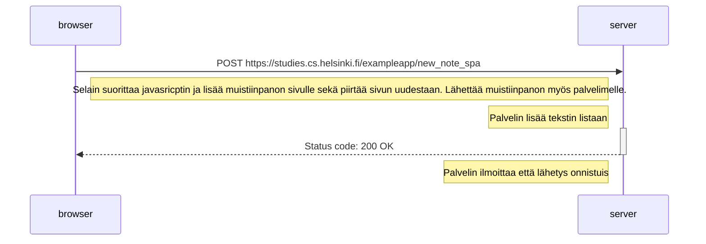

```mermaid
sequenceDiagram
    participant browser
    participant server
    
    browser->>server: POST 	https://studies.cs.helsinki.fi/exampleapp/new_note_spa
    Note right of browser: Selain suorittaa javasricptin ja lisää muistiinpanon sivulle sekä piirtää sivun uudestaan. Lähettää muistiinpanon myös palvelimelle.
    Note left of server: Palvelin lisää tekstin listaan
    activate server
    server-->>browser: Status code: 200 OK
    deactivate server
    Note left of server: Palvelin ilmoittaa että lähetys onnistuis

    
```
